# Awesome-Multitask-Learning
<!-- This repository periodicly updates the the papers and resources of MTL. -->
Our survey primarily aims to provide a comprehensive understanding of MTL, encompassing its definition, taxonomy, applications, and their connections and trends. We delve into the various aspects of MTL methods, including the loss function, network architecture, and optimization methods, offering explanations and insights from the perspective of technical details. For each method, we provide the corresponding paper link, as well as the code repository for the MTL methods discussed in the paper. We sincerely hope that this survey aids in your comprehension of MTL and its associated methods. If you have any questions or suggestions, please feel free to contact us.
> [**Unleashing the Power of Multi-Task Learning: A Comprehensive Survey Spanning Traditional, Deep, and Pre-Trained Foundation Model Eras **](https://junfish.github.io/)

## Table of Contents:
- [Awesome-Multitask-Learning](#awesome-multitask-learning)
  - [Table of Contents:](#table-of-contents)
  - [Existing survey papers](#existing-survey-papers)
  - [Datasets](#datasets)
    - [Regression task](#regression-task)
    - [Classification task](#classification-task)
    - [Dense prediction task](#dense-prediction-task)
  - [Methods](#methods)
    - [Traditional era](#traditional-era)
      - [Sparse Learning](#sparse-learning)
      - [Feature Learning](#feature-learning)
      - [Low-rank Learning](#low-rank-learning)
      - [Learning via Decomposition](#learning-via-decomposition)
      - [Learning via Factorization](#learning-via-factorization)
      - [Task Relationship Learning](#task-relationship-learning)
      - [Task Clustering](#task-clustering)
    - [Deep Learning Era](#deep-learning-era)
      - [Feature Fusion](#feature-fusion)
      - [Cascading](#cascading)
      - [Knowledge Distillation](#knowledge-distillation)
      - [Cross-Task Attention](#cross-task-attention)
      - [Scalarization Approach](#scalarization-approach)
      - [Task Conditioning](#task-conditioning)
      - [Adversarial Training](#adversarial-training)
      - [Task Scheduling](#task-scheduling)
      - [Mixture of Experts](#mixture-of-experts)
      - [Graph-based](#graph-based)
<!-- - [Architectures](#architectures)
  - [Encoder-based](#encoder)
  - [Decoder-based](#decoder)
  - [Other](#otherarchitectures)
- [Neural Architecture Search](#nas)
- [Optimization strategies](#optimization)
- [Transfer learning](#transfer) -->

## Existing survey papers
<!-- -  Vandenhende, S., Georgoulis, S., Van Gansbeke, W., Proesmans, M., Dai, D., & Van Gool, L. 
*[Multi-Task Learning for Dense Prediction Tasks: A Survey](https://ieeexplore.ieee.org/abstract/document/9336293)*,
T-PAMI, 2020. [[PyTorch](https://github.com/SimonVandenhende/Multi-Task-Learning-PyTorch)] -->
- **An overview of multi-task learning in deep neural networks** \
*Sebastian Ruder* \
arXiv 2017. [[Paper](https://arxiv.org/abs/1706.05098)] \
Jun 15, 2017

- **A brief review on multi-task learning** [[Paper](https://link.springer.com/article/10.1007/s11042-018-6463-x)] \
*Kim-Han Thung, Chong-Yaw Wee* \
Multimedia Tools and Applications 2018. \
Aug 08, 2018

- **Multi-task learning for dense prediction tasks: A survey** \
*Simon Vandenhende, Stamatios Georgoulis, Marc Proesmans, Dengxin Dai and Luc Van Gool* \
IEEE Transactions on Pattern Analysis and Machine Intelligence 2021. [[Paper](https://ieeexplore.ieee.org/abstract/document/9336293)] \
Jan 26, 2021
- **A Brief Review of Deep Multi-task Learning and Auxiliary Task Learning** \
*Partoo Vafaeikia and Khashayar Namdar and Farzad Khalvati* \
arXiv 2020. [[Paper](https://arxiv.org/abs/2007.01126)] \
Jul 02, 2020
- **Multi-Task Learning with Deep Neural Networks: A Survey** \
*Michael Crawshaw* \
arXiv 2020. [[Paper](https://arxiv.org/abs/2009.09796)] \
Sep 10, 2020
- **A survey on multi-task learning** \
*Yu Zhang and Qiang Yang*
IEEE Transactions on Knowledge and Data Engineering 2022. [[Paper]](https://ieeexplore.ieee.org/abstract/document/9392366) \
March 31, 2021
<!-- -  S. Ruder, “*[An overview of multi-task learning in deep neural networks](https://arxiv.org/abs/1706.05098),” arXiv preprint arXiv:1706.05098, 2017. -->
<!-- -  K.-H. Thung and C.-Y. Wee, “*[A brief review on multi-task learning](https://link.springer.com/article/10.1007/s11042-018-6463-x),” Multimedia Tools and Applications, vol. 77, no. 22, pp. 29705–29725, 2018. -->
<!-- - S. Vandenhende, S. Georgoulis, W. Van Gansbeke, M. Proesmans, D. Dai, and L. Van Gool, “*[Multi-task learning for dense prediction tasks: A survey](https://arxiv.org/abs/2004.13379),” IEEE transactions on pattern analysis and machine intelligence, 2021. -->
<!-- -  P. Vafaeikia, K. Namdar, and F. Khalvati, “*[A brief review of deep multi-task learning and auxiliary task learning](),” arXiv preprint arXiv:2007.01126, 2020. -->
<!-- -  M. Crawshaw, “Multi-task learning with deep neural networks: A survey,” arXiv preprint arXiv:2009.09796, 2020. -->
<!-- -  Y. Zhang and Q. Yang, “*[A survey on multi-task learning](https://ieeexplore.ieee.org/document/9392366),” IEEE Transactions on Knowledge and Data Engineering, 2021. -->

## Datasets

### Regression task
- **Synthetic Data**
This dataset is often artificially defined by researchers, thus different from one another. The features are often generated via drawing random variables from a shared distribution and adding irrelevant variants from other distributions, and the corresponding responses are produced by a specific computational method.

- [School Data](http://www.bristol.ac.uk/cmm/learning/)
This dataset comes from the Inner London Education Authority (ILEA) and
contains 15,362 records of student examination, which are described by 27 student- and school-specific features from 139 secondary schools. The goal is to predict exam scores from 27 features.

- [SARCOS Data](http://gaussianprocess.org/gpml/data/)
This dataset is in humanoid robotics consists of 44,484 training examples and
4, 449 test examples. The goal of learning is to estimate inverse dynamics model of a 7 degrees-of-freedom (DOF) SARCOS anthropomorphic robot arm.

- **Computer Survey Data**
This dataset is from a survey on the likelihood (11 point scale from 0 to 10) of purchasing personal computers. There are 20 computer models as examples, each of which contains 13 computer descriptions (e.g., price, CPU speed, and screen size) and 6 subject-level covariates (e.g., gender, computer knowledge, and work experience) as features and ratings of 179 subjects as targets, i.e., tasks.
- [Climate Dataset](https://www.cambermet.co.uk/(S(jevn1q55xcd0n42oueeyrp45))/default.aspx)
This real-time dataset is collected from a sensor network (e.g., anemometer,
thermistor, and pressure transducer) of four climate stations—Cambermet, Chimet, Sotonmet and Bramblemet—in the south on England, which can represent 4 tasks as needed. The archived data are reported in 5-minute intervals, including ∼ 10 climate signals (e.g., wind speed, wave period, barometric pressure, and water temperature).

### Classification task
- [20 Newsgroups](http://qwone.com/~jason/20Newsgroups/)
This dataset is a collection of approximately 19, 000 netnews articles, organized into 20 hierarchical newsgroups according to the topic, such as root categories (e.g., comp,rec, sci, and talk) and sub-categories (e.g., comp.graphics, sci.electronics, and talk.politics.guns). Users can design different combinations as multiple text classifications tasks.

- [Reuters-21578 Collection](http://www.daviddlewis.com/resources/testcollections/reuters21578/)
This text collection contains 21578 documents from Reuters newswire dating back to 1987. These documents were assembled and indexed with more than 90 correlated categories—5 top categories (i.e., exchanges, orgs, people, place, topic), and each of them includes variable sub-categories。

- [MultiMNIST](http://www.cs.toronto.edu/~tijmen/affNIST/)
This dataset is a MTL version of MNIST dataset9. By overlaying multiple images together, traditional digit classification is converted to a MTL problem, where classifying the digits on the different positions are considered as distinctive tasks.

- [ImageCLEF-2014](https://www.imageclef.org/2014/adaptation)
This dataset is a benchmark for domain adaptation challenge, which contains 2, 400 images of 12 common categories selected from 4 domains: Caltech 256, ImageNet 2012, Pascal VOC 2012, and Bing.

- [Office-Caltech](https://www.v7labs.com/open-datasets/office-caltech-10)
This dataset is a standard benchmark for domain adaption in computer vision, consisting of real-world images of 10 common categories from Office dataset and Caltech-256 dataset. There are 2,533 images from 4 distinct domains/tasks: Amazon, DSLR, Webcam, and Caltech.

- [Office-31](https://opendatalab.com/Office-31)
This dataset consists of 4,110 images from 31 object categories across 3 domains/tasks: Amazon, DSLR, and Webcam.
  
- [Office-Home Dataset.](https://www.hemanthdv.org/officeHomeDataset.html)
This dataset is collected for object recognition to validate domain adaptation models in the era of deep learning, which includes 15,588 images images in office and home settings (e.g., alarm clock, chair, eraser, keyboard, telephone, etc.) organized into 4 domains/tasks: Art (paintings, sketches and artistic depictions), Clipart (clipart images), Product (product images from www.amazon.com), and Real-World (real-world objects captured with a regular camera).

- [DomainNet](http://ai.bu.edu/M3SDA/)
This dataset is annotated for the purpose of multi-source unsupervised domain adaptation (UDA) research. It contains ∼ 0.6 million images from 345 categories across 6 distinct domains, e.g., sketch, infograph, quickdraw, real, etc.

- [EMMa](https://emma.stanford.edu/)
This dataset comprises more than 2.8 million objects from Amazon product listings, each annotated with images, listing text, mass, price, product ratings, and its position in Amazon’s product-category taxonomy. It includes a comprehensive taxonomy of 182 physical materials, and objects are annotated with one or more materials from this taxonomy. EMMa offers a new benchmark for multi-task learning in computer vision and NLP, allowing for the addition of new tasks and object attributes at scale.

- [SYNTHIA](https://synthia-dataset.net/)
This dataset is a synthetic dataset created to address the need for a large and diverse collection of images with pixel-level annotations for vision-based semantic segmentation in urban scenarios, particularly for autonomous driving applications. It consists of precise pixel-level semantic annotations for 13 classes, including sky, building, road, sidewalk, fence, vegetation, lane-marking, pole, car, traffic signs, pedestrians, cyclists, and miscellaneous objects.

### Dense prediction task

- [CityScapes](https://www.cityscapes-dataset.com/)
This dataset consists of 5,000 images with high quality annotations
and 20,000 images with coarse annotations from 50 different cities, which contains 19 classes for semantic urban scene understanding. 

- [NYU-Depth Dataset V2](https://cs.nyu.edu/~silberman/datasets/nyu_depth_v2.html)
This dataset is comprised of 1,449 images from 464 indoor scenes across 3 cities, which contains 35,064 distinct objects of 894 different classes. The dense per-pixel labels of class, instance, and depth are used in many computer vision tasks, e.g., semantic segmentation, depth prediction, and surface normal estimation.

- [PASCAL VOC Project](http://host.robots.ox.ac.uk/pascal/VOC/)
This project provides standardized image datasets for object class recognition and also has run challenges evaluating performance on object class recognition from 2005 to 2012, where [VOC07](http://host.robots.ox.ac.uk/pascal/VOC/voc2007/index.html), [VOC08](http://host.robots.ox.ac.uk/pascal/VOC/voc2008/index.html), and [VOC12](http://host.robots.ox.ac.uk/pascal/VOC/voc2012/index.html) are commonly used for MTL research. The multiple tasks covers classification, detection (e.g., body part, saliency, semantic edge), segmentation, attribute prediction, surface normals prediction, etc. 

- [Taskonomy](https://github.com/StanfordVL/taskonomy/tree/master/data#downloading-the-dataset-new-oct-2021)
This dataset is currently the most diverse product for computer vision in
MTL, consisting of 4 million samples from 3D scans of ∼ 600 buildings. This product is a dictionary of 26 tasks (e.g., 2D, 2.5D, 3D, semantics, etc.) as a computational taxonomic map for task transfer learning. 

## Methods

### Traditional era

#### Sparse Learning

- **Multi-Task Feature Selection** \
*Guillaume Obozinski, Ben Taskar and Michael Jordan* \
researchgate 2006. [[Paper](https://www.researchgate.net/profile/Guillaume-Obozinski/publication/228666354_Multi-task_feature_selection/links/0a85e53b2c728afb52000000/Multi-task-feature-selection.pdf)]   

- **A probabilistic framework for multi-task learning** \
*Jian Zhang* \
Ph.D. Thesis 2006. [[Paper](https://cse.sustech.edu.cn/faculty/~zhangy/papers/Yu_Zhang_PhD_Thesis.pdf)] 

- **Dirty Block-Sparse Model** \
*Ali Jalali, Sujay Sanghavi, Chao Ruan and Pradeep Ravikumar* \
Advances in neural information processing systems 2010. [[Paper](https://proceedings.neurips.cc/paper/2010/hash/00e26af6ac3b1c1c49d7c3d79c60d000-Abstract.html)] 

- **Sparse Multi-Task Lasso** \
*Aurelie C Lozano and Grzegorz Swirszcz* \
Proceedings of the 29th International Coference on International Conference on Machine Learning 2012. [[Paper](https://dl.acm.org/doi/abs/10.5555/3042573.3042652)]

- **Adaptive Sparse Multi-Task Lasso** \
*Seunghak Lee, Jun Zhu and Eric Xing* \
Advances in neural information processing systems 2010. [[Paper](https://proceedings.neurips.cc/paper/2010/hash/3cf166c6b73f030b4f67eeaeba301103-Abstract.html)]

- **A multi-task learning formulation for predicting disease progression** \
*Jiayu Zhou, Lei Yuan, Jun Liu and Jieping Ye* \
Proceedings of the 17th ACM SIGKDD international conference on Knowledge discovery and data mining 2011. [[Paper](https://dl.acm.org/doi/abs/10.1145/2020408.2020549)]

- **Modeling disease progression via fused sparse group lasso** \
*Jiayu Zhou, Jun Liu, Vaibhav A Narayan and Jieping Ye* \
Proceedings of the 18th ACM SIGKDD international conference on Knowledge discovery and data mining 2012. [[Paper](https://dl.acm.org/doi/abs/10.1145/2339530.2339702?casa_token=19FLLXrMooMAAAAA:cV8xhbjZigE8Nh89yeBCsAz3Bpzp9gs4vAeUpWTvy-N52l_iOXpL-MJ3JO13zDiVmqkrr-4aMQup)]

- **Adaptive multi-task sparse learning with an application to fMRI study** [[Paper](https://epubs.siam.org/doi/abs/10.1137/1.9781611972825.19)] \
*Xi Chen, Jinghui He, Rick Lawrence and Jaime G Carbonell* \
Proceedings of the 2012 SIAM International Conference on Data Mining 2012. 

- **Multi-stage multi-task feature learning** [[Paper](https://proceedings.neurips.cc/paper/2012/hash/2ab56412b1163ee131e1246da0955bd1-Abstract.html)] \
*Pinghua Gong, Jieping Ye and Changshui Zhang* \
Advances in neural information processing systems 2012. 

#### Feature Learning
- **A framework for learning predictive structures from multiple tasks and
unlabeled data** [[Paper](https://www.jmlr.org/papers/volume6/ando05a/ando05a.pdf)] \
*Rie Kubota Ando, Tong Zhang and Peter Bartlett* \
Journal of Machine Learning Research 2005. 

- **A convex formulation for learning shared structures from multiple tasks** [[Paper](https://dl.acm.org/doi/abs/10.1145/1553374.1553392?casa_token=l-kQ9i88wJAAAAAA:K6TvNZGzne_TONBUpUNuYLRtY0QnPpF3GhKtiexV9EUtqOfOBEpQXI_5JlJuyi3_3apLj7pTVJhQ)] \
*Jianhui Chen, Lei Tang, Jun Liu and Jieping Ye* \
Proceedings of the 26th annual international conference on machine learning 2009. 

- **Multi-task feature learning** [[Paper](https://proceedings.neurips.cc/paper_files/paper/2006/hash/0afa92fc0f8a9cf051bf2961b06ac56b-Abstract.html)] \
*Andreas Argyriou, Theodoros Evgeniou and Massimiliano Pontil* \
Advances in neural information processing systems 2006. 

- **Multi-task learning for multiple language translation** [[Paper](https://aclanthology.org/P15-1166.pdf)] \
*Daxiang Dong, Hua Wu, Wei He, Dianhai Yu and Haifeng Wang* \
Proceedings of the 53rd Annual Meeting of the Association for Computational Linguistics and the 7th International Joint Conference on Natural Language Processing 2015. 

#### Low-rank Learning

- **An accelerated gradient method for trace norm minimization** [[Paper](https://dl.acm.org/doi/abs/10.1145/1553374.1553434?casa_token=9J7YNGdK0jEAAAAA:enMIpGXqhGpAPKlYswpPOyLqlztQx9OwdTHnKGXV5L0HRvx0Wz2UjJY3cP73VTU84PqG7R6k-dJu)] \
*Shuiwang Ji and Jieping Ye* \
Proceedings of the 26th annual international conference on machine learning 2009. 

- **Multi-stage multi-task learning with reduced rank** [[Paper](https://ojs.aaai.org/index.php/AAAI/article/view/10261)] \
*Lei Han and Yu Zhang* \
Proceedings of the AAAI Conference on Artificial Intelligence 2016. 

#### Learning via Decomposition

- **Integrating low-rank and group-sparse structures for robust multi-task learning** [[Paper](https://dl.acm.org/doi/abs/10.1145/2020408.2020423?casa_token=ztgYGGR1stsAAAAA:awKc_tKgcDBo6oL8s7kwngbfIqMi_O5gePUIUQiZUtaBNvgmCU670NbfPdO487XFCUoJOGH_wsAb)] \
*Jianhui Chen, Jiayu Zhou and Jieping Ye* \
Proceedings of the 17th ACM SIGKDD international conference on Knowledge discovery and data mining 2011. 

- **Learning incoherent sparse and low-rank patterns from multiple tasks** [[Paper](https://dl.acm.org/doi/abs/10.1145/2086737.2086742?casa_token=bqKYlMtacY4AAAAA:M3s9srPyiaWN8bMbbTUQY29nn1ezG1zhXqC-I67l4-IqyHuo60h86ucD4y_NDYbWVV68pK1XJCcT)] \
*Jianhui Chen, Ji Liu and Jieping Ye* \
ACM Transactions on Knowledge Discovery from Data 2012. 

- **Multi-level lasso for sparse multi-task regression** [[Paper](https://dl.acm.org/doi/abs/10.5555/3042573.3042652)] \
*Aurelie C Lozano and Grzegorz Swirszcz* \
Proceedings of the 29th International Coference on International Conference on Machine Learning 2012. 

- **Robust multi-task feature learning** [[Paper](https://dl.acm.org/doi/abs/10.1145/2339530.2339672?casa_token=eakEuKmTUtEAAAAA:xeumdsvJ0ojB-uWcRnMUjscW-G4ry1fqlEveVLvlt5rnV5M1ZgxJxc1N0h3unKi9_JJrgK4kF4rq)] \
*Pinghua Gong, Jieping Ye and Changshui Zhang* \
Proceedings of the 18th ACM SIGKDD international conference on Knowledge discovery and data mining 2012. 

#### Learning via Factorization

#### Task Relationship Learning

#### Task Clustering

### Deep Learning Era

#### Feature Fusion

<table style="width:100%">
  <tr>
    <th style="width:50%">Paper</th>
    <th style="width:50%">Network</th>
  </tr>
  <tr>
    <td style="width:50%">
      <b>Cross-stitch networks for multi-task learning</b> <a href="https://openaccess.thecvf.com/content_cvpr_2016/html/Misra_Cross-Stitch_Networks_for_CVPR_2016_paper.html"><i>[Paper]</i></a> 
      <a href = "https://github.com/helloyide/Cross-stitch-Networks-for-Multi-task-Learning"><i>[Code]</i></a> 
      <b>Authors:</b> Ishan Misra, Abhinav Shrivastava, Abhinav Gupta and Martial Hebert 
      <b>Publisher:</b> CVPR  
      <b>Year:</b> 2016  
    </td>
    <td style="width:50%">
      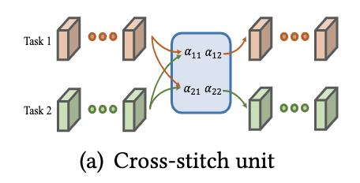
    </td>
    
  </tr>
  <tr>
    <td style="width:50%">
      <b>Latent multi-task architecture learning</b> <a href="https://ojs.aaai.org/index.php/AAAI/article/view/4410"><i>[Paper]</i></a> 
       
      <b>Authors:</b> Sebastian Ruder, Joachim Bingel, Isabelle Augenstein and Anders Sogaard 
      <b>Publisher:</b> Proceedings of the AAAI Conference on Artificial Intelligence  
      <b>Year:</b> 2019  
    </td>
    <td style="width:50%">
      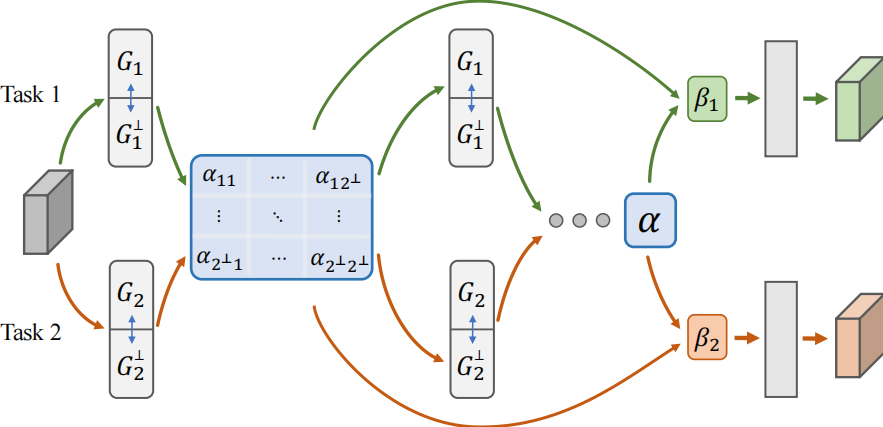
    </td> 
  </tr>
  <tr>
    <td style="width:50%">
      <b>Nddr-cnn: Layerwise feature fusing in multi-task cnns by neural discriminative dimensionality reduction</b> <a href="https://scholar.google.com/scholar?hl=en&as_sdt=0%2C39&q=%E2%80%9CNddr-cnn%3A+Layerwise+feature+fusing+in+multi-task+cnns+by+neural+discriminative+dimensionality+reduction%2C&btnG="><i>[Paper]</i></a> 
      <a href = "https://github.com/ethanygao/NDDR-CNN"><i>[Code]</i></a>
       
      <b>Authors:</b> Yuan Gao, Jiayi Ma, Mingbo Zhao , Wei Liu and Alan L Yuille 
      <b>Publisher:</b> Proceedings of the IEEE/CVF conference on computer vision and pattern recognition  
      <b>Year:</b> 2019  
    </td>
    <td style="width:50%">
      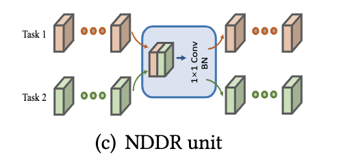
    </td> 
  </tr>
</table>

#### Cascading

<table style="width:100%">
  <tr>
    <th style="width:50%">Paper</th>
    <th style="width:50%">Network</th>
  </tr>
  <tr>
    <td style="width:50%">
      <b>Deep multi-task learning with low level tasks supervised at lower layers</b> <a href="https://aclanthology.org/P16-2038/"><i>[Paper]</i></a> 
      <!-- <a href = "https://github.com/VICO-UoE/KD4MTL"><i>[Code]</i></a> -->
       
      <b>Authors:</b> Anders S{\o}gaard and Yoav Goldberg 
      <b>Publisher:</b> Proceedings of the 54th Annual Meeting of the Association for Computational Linguistics (Volume 2: Short Papers  
      <b>Year:</b> 2016  
    </td>
    <!-- <td style="width:50%">
      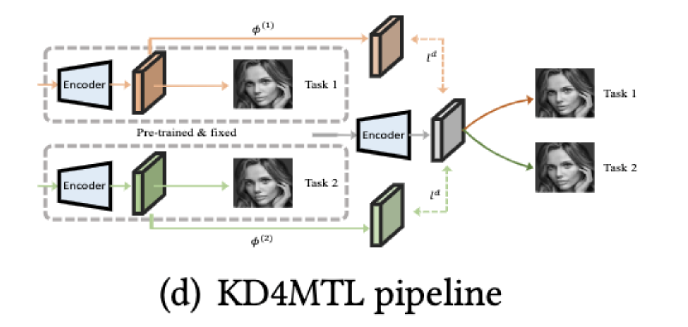
    </td> -->
    
  </tr>
  <tr>
    <td style="width:50%">
      <b>Instance-aware semantic segmentation via multi-task network cascades</b> <a href="https://openaccess.thecvf.com/content_cvpr_2016/html/Dai_Instance-Aware_Semantic_Segmentation_CVPR_2016_paper.html"><i>[Paper]</i></a> 
      <a href = "https://github.com/daijifeng001/MNC"><i>[Code]</i></a>
       
      <b>Authors:</b> Jifeng Dai, Kaiming He and Jian Sun 
      <b>Publisher:</b> Proceedings of the IEEE conference on computer vision and pattern recognition  
      <b>Year:</b> 2016  
    </td>
    <!-- <td style="width:50%">
      
    </td> -->
    
  </tr>

  <tr>
    <td style="width:50%">
      <b>A Joint Many-Task Model: Growing a Neural Network for
Multiple NLP Tasks</b> <a href="https://arxiv.org/abs/1611.01587"><i>[Paper]</i></a> 
      <a href = "https://github.com/hassyGo/charNgram2vec"><i>[Code]</i></a>
       
      <b>Authors:</b> Kazuma Hashimoto, Caiming Xiong, Yoshimasa Tsuruoka, Richard Socher  
      <b>Publisher:</b> arXiv preprint arXiv:1611.01587  
      <b>Year:</b> 2016  
    </td>
    <!-- <td style="width:50%">
      
    </td> -->
    
  </tr>

  <tr>
    <td style="width:50%">
      <b>  Deep cascade multi-task learning for slot filling in online shopping assistant</b> <a href="https://ojs.aaai.org/index.php/AAAI/article/view/4611"><i>[Paper]</i></a> 
      <a href = "https://github.com/gy910210/DCMTL"><i>[Code]</i></a>
       
      <b>Authors:</b> Yu Gong, Xusheng Luo, Yu Zhu, Wenwu Ou, Zhao Li, Muhua Zhu, Kenny Q. Zhu, Lu Duan and Xi Chen  
      <b>Publisher:</b> Proceedings of the AAAI conference on artificial intelligence  
      <b>Year:</b> 2019   
    </td>
    <!-- <td style="width:50%">
      
    </td> -->
    
  </tr>
  <tr>
    <td style="width:50%">
      <b> A hierarchical multi-task approach for learning embeddings from semantic tasks</b> <a href="https://ojs.aaai.org/index.php/AAAI/article/view/4673"><i>[Paper]</i></a> 
      <a href = "https://github.com/huggingface/hmtl"><i>[Code]</i></a>
       
      <b>Authors:</b> Victor Sanh, Thomas Wolf and Sebastian Ruder  
      <b>Publisher:</b> Proceedings of the AAAI conference on artificial intelligence  
      <b>Year:</b> 2019   
    </td>
    <!-- <td style="width:50%">
      
    </td> -->
    
  </tr>

</table>

#### Knowledge Distillation

<table style="width:100%">
  <tr>
    <th style="width:50%">Paper</th>
    <th style="width:50%">Network</th>
  </tr>
  <tr>
    <td style="width:50%">
      <b>Knowledge distillation for multi-task learning</b> <a href="https://link.springer.com/chapter/10.1007/978-3-030-65414-6_13"><i>[Paper]</i></a> 
      <a href = "https://github.com/VICO-UoE/KD4MTL"><i>[Code]</i></a> 
      <b>Authors:</b> WeiHong Li and Hakan Bilen 
      <b>Publisher:</b> Computer Vision--ECCV  
      <b>Year:</b> 2020  
    </td>
    <td style="width:50%">
      
    </td>
    
  </tr>

  <tr>
    <td style="width:50%">
      <b>Multi-task self-training for learning general representations</b> <a href="https://openaccess.thecvf.com/content/ICCV2021/html/Ghiasi_Multi-Task_Self-Training_for_Learning_General_Representations_ICCV_2021_paper.html"><i>[Paper]</i></a> 
      <!-- <a href = "https://github.com/VICO-UoE/KD4MTL"><i>[Code]</i></a> -->
       
      <b>Authors:</b> Golnaz Ghiasi, Barret Zoph, Ekin D Cubuk and Quoc V Le and Tsung-Yi Lin 
      <b>Publisher:</b> Proceedings of the IEEE/CVF International Conference on Computer Vision  
      <b>Year:</b> 2021  
    </td>
    <td style="width:50%">
      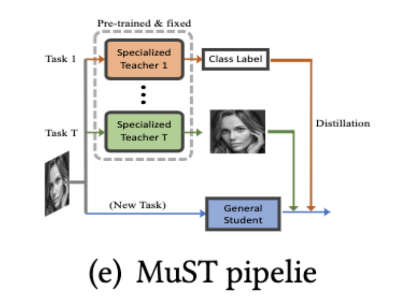
    </td>
  </tr>
  <tr>
    <td style="width:50%">
      <b>Cross-task knowledge distillation in multi-task recommendation</b> <a href="https://ojs.aaai.org/index.php/AAAI/article/view/20352"><i>[Paper]</i></a> 
      <!-- <a href = "https://github.com/VICO-UoE/KD4MTL"><i>[Code]</i></a> -->
       
      <b>Authors:</b> Chenxiao Yang, Junwei Pan, Xiaofeng Gao, Tingyu Jiang, Dapeng Liu and Guihai Chen 
      <b>Publisher:</b> Proceedings of the AAAI Conference on Artificial Intelligence  
      <b>Year:</b> 2022  
    </td>
    <td style="width:50%">
      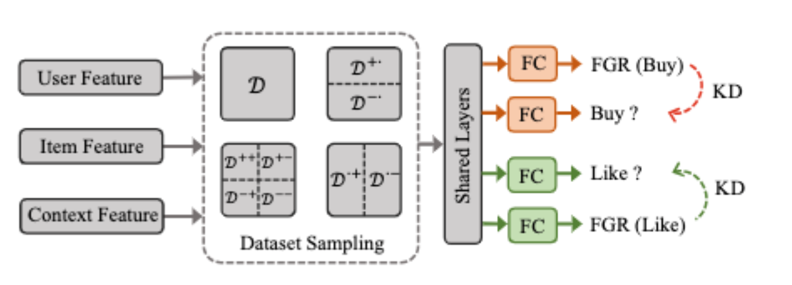
    </td>
    
  </tr>
  <tr>
    <td style="width:50%">
      <b>Online Knowledge Distillation for Multi-Task Learning</b> <a href="https://openaccess.thecvf.com/content/WACV2023/html/Jacob_Online_Knowledge_Distillation_for_Multi-Task_Learning_WACV_2023_paper.html"><i>[Paper]</i></a> 
      <!-- <a href = "https://github.com/VICO-UoE/KD4MTL"><i>[Code]</i></a> -->
       
      <b>Authors:</b> Geethu Miriam Jacob and Vishal Agarwal 
      <b>Publisher:</b> Proceedings of the IEEE/CVF Winter Conference on Applications of Computer Vision  
      <b>Year:</b> 2023  
    </td>
    <td style="width:50%">
      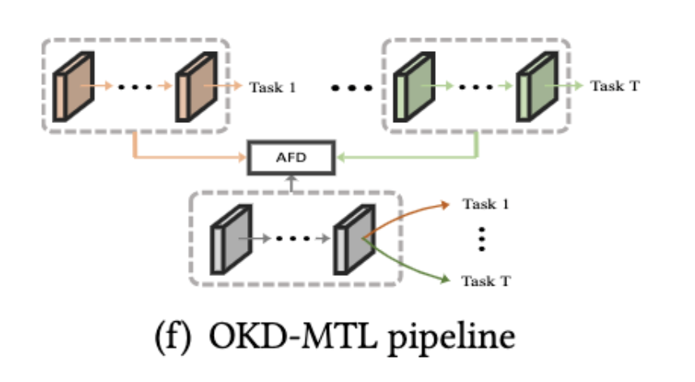
    </td>
    
  </tr>
</table>

#### Cross-Task Attention

<table style="width:100%">
  <tr>
    <th style="width:50%">Paper</th>
    <th style="width:50%">Network</th>
  </tr>
  <tr>
    <td style="width:50%">
      <b>Pad-net: Multi-tasks guided prediction-and-distillation network for simultaneous depth estimation and scene parsing</b> <a href="https://openaccess.thecvf.com/content_cvpr_2018/html/Xu_PAD-Net_Multi-Tasks_Guided_CVPR_2018_paper.html"><i>[Paper]</i></a> 
      <!-- <a href = "https://github.com/VICO-UoE/KD4MTL"><i>[Code]</i></a>  -->
       
      <b>Authors:</b> Dan Xu, Wanli Ouyang, Xiaogang Wang and Nicu Sebe 
      <b>Publisher:</b> Proceedings of the IEEE Conference on Computer Vision and Pattern Recognition  
      <b>Year:</b> 2018  
    </td>
    <td style="width:50%">
      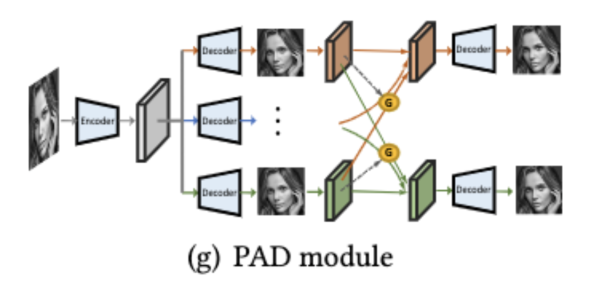
    </td>
  </tr>
  <tr>
    <td style="width:50%">
      <b>End-to-end multi-task learning with attention</b> <a href="https://openaccess.thecvf.com/content_CVPR_2019/html/Liu_End-To-End_Multi-Task_Learning_With_Attention_CVPR_2019_paper.html"><i>[Paper]</i></a> 
      <a href = "https://github.com/lorenmt/mtan"><i>[Code]</i></a> 
      <b>Authors:</b> Shikun Liu, Edward Johns and Andrew J Davison 
      <b>Publisher:</b> Proceedings of the IEEE Conference on Computer Vision and Pattern Recognition  
      <b>Year:</b> 2019  
    </td>
    <!-- <td style="width:50%">
      
    </td> -->
  </tr>
  <tr>
    <td style="width:50%">
      <b>Pattern-affinitive propagation across depth, surface normal and semantic segmentation</b> <a href="https://openaccess.thecvf.com/content_CVPR_2019/html/Zhang_Pattern-Affinitive_Propagation_Across_Depth_Surface_Normal_and_Semantic_Segmentation_CVPR_2019_paper.html"><i>[Paper]</i></a> 
      <!-- <a href = "https://github.com/lorenmt/mtan"><i>[Code]</i></a> -->
       
      <b>Authors:</b> Zhenyu Zhang, Zhen Cui, Chunyan Xu, Yan Yan, Nicu Sebe and Jian Yang 
      <b>Publisher:</b> Proceedings of the IEEE Conference on Computer Vision and Pattern Recognition  
      <b>Year:</b> 2019  
    </td>
    <td style="width:50%">
      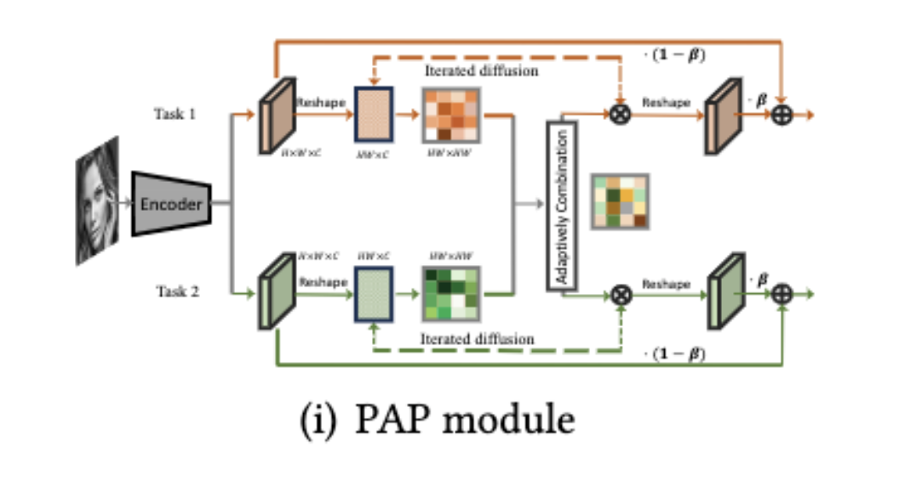
    </td>
    
  </tr>
  <tr>
    <td style="width:50%">
      <b>Pattern-structure diffusion for multi-task learning</b> <a href="https://openaccess.thecvf.com/content_CVPR_2020/html/Zhou_Pattern-Structure_Diffusion_for_Multi-Task_Learning_CVPR_2020_paper.html"><i>[Paper]</i></a> 
      <!-- <a href = "https://github.com/lorenmt/mtan"><i>[Code]</i></a> -->
       
      <b>Authors:</b> Ling Zhou, Zhen Cui, Chunyan Xu, Zhenyu Zhang, Chaoqun Wang, Tong Zhang and Jian Yang 
      <b>Publisher:</b> Proceedings of the IEEE Conference on Computer Vision and Pattern Recognition  
      <b>Year:</b> 2020  
    </td>
    <td style="width:50%">
      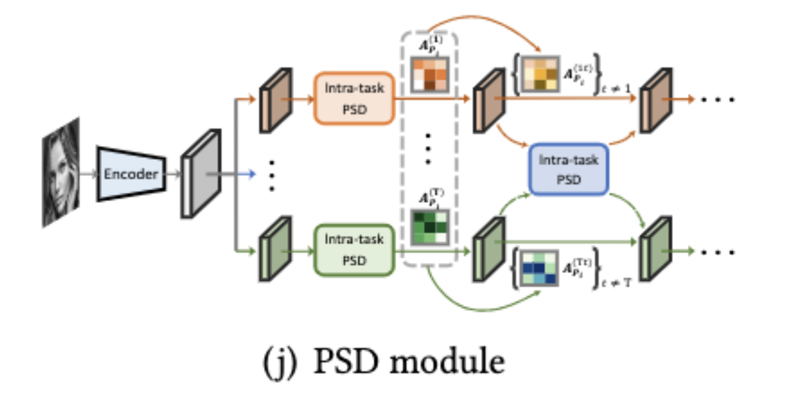
    </td>
    
  </tr>
  <tr>
    <td style="width:50%">
      <b>Mti-net: Multi-scale task interaction networks for multi-task
learning</b> <a href="https://link.springer.com/chapter/10.1007/978-3-030-58548-8_31"><i>[Paper]</i></a> 
      <a href = "https://github.com/SimonVandenhende/Multi-Task-Learning-PyTorch"><i>[Code]</i></a>
       
      <b>Authors:</b> Simon Vandenhende, Stamatios Georgoulis and Luc Van Gool 
      <b>Publisher:</b> Computer Vision--ECCV 2020: 16th European Conference, Glasgow, UK, August 23--28, 2020, Proceedings, Part IV 16  
      <b>Year:</b> 2020  
    </td>
    <!-- <td style="width:50%">
      
    </td> -->
    
  </tr>
  <tr>
    <td style="width:50%">
      <b>Attentive single-tasking of multiple tasks</b> 
      <a href="https://openaccess.thecvf.com/content_CVPR_2019/html/Maninis_Attentive_Single-Tasking_of_Multiple_Tasks_CVPR_2019_paper.html"><i>[Paper]</i></a> 
      <a href = "https://github.com/facebookresearch/astmt"><i>[Code]</i></a>
       
      <b>Authors:</b> Kevis-Kokitsi Maninis, Ilija Radosavovic and Iasonas Kokkinos 
      <b>Publisher:</b> Proceedings of the IEEE/CVF Conference on Computer Vision and Pattern Recognition  
      <b>Year:</b> 2019  
    </td>
    <td style="width:50%">
      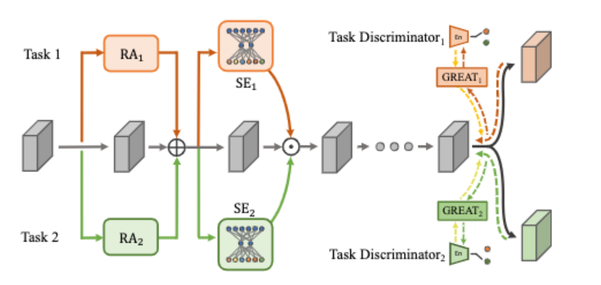
    </td>
    
  </tr>

  <tr>
  <td style="width:50%">
    <b>Exploring relational context for multi-task dense prediction</b> 
    <a href="https://openaccess.thecvf.com/content/ICCV2021/html/Bruggemann_Exploring_Relational_Context_for_Multi-Task_Dense_Prediction_ICCV_2021_paper.html"><i>[Paper]</i></a> 
    <a href = "https://github.com/brdav/atrc"><i>[Code]</i></a>
     
    <b>Authors:</b> David Bruggemann, Menelaos Kanakis, Anton Obukhov, Stamatios Georgoulis and Luc Van Gool 
    <b>Publisher:</b> Proceedings of the IEEE/CVF Conference on Computer Vision and Pattern Recognition  
    <b>Year:</b> 2021  
  </td>
  <td style="width:50%">
    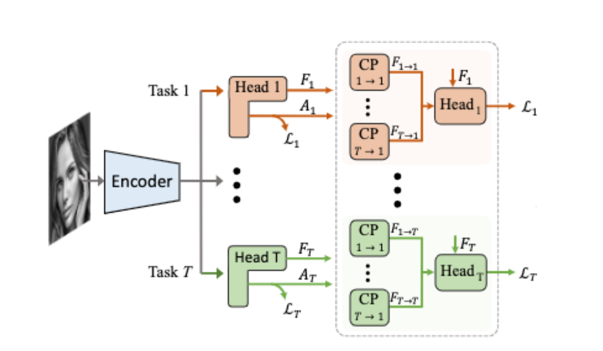
  </td>
  
  </tr>

  <tr>
  <td style="width:50%">
    <b> Demt: Deformable mixer transformer for multi-task learning of dense prediction</b> 
    <a href="https://ui.adsabs.harvard.edu/abs/2023arXiv230103461X/abstract"><i>[Paper]</i></a> 
    <a href = "https://github.com/yangyangxu0/demt"><i>[Code]</i></a>
     
    <b>Authors:</b> Yangyang Xu, Yibo Yang and Lefei Zhang 
    <b>Publisher:</b> arXiv e-prints  
    <b>Year:</b> 2023  
  </td>
  <td style="width:50%">
    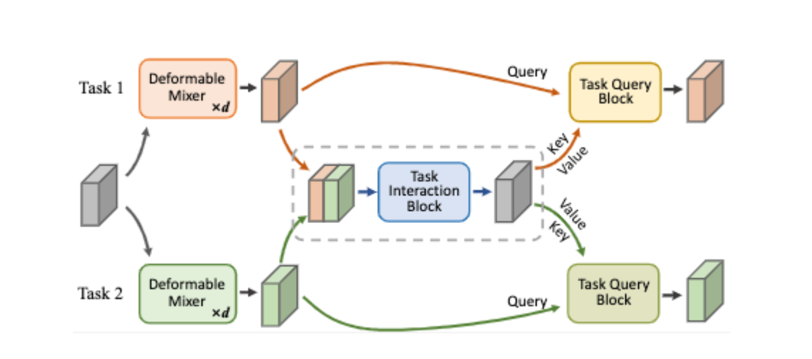
  </td>
  
  </tr> 

</table>

#### Scalarization Approach
<table style="width:100%">

  <tr>
    <th style="width:50%">Paper</th>
    <th style="width:50%">Network</th>
  </tr>
  <tr>
    <td style="width:50%">
      <b>Gradient surgery for multi-task learning</b> <a href="https://proceedings.neurips.cc/paper/2020/hash/3fe78a8acf5fda99de95303940a2420c-Abstract.html"><i>[Paper]</i></a> 
      <a href = "https://github.com/tianheyu927/PCGrad"><i>[Code]</i></a> 
      <b>Authors:</b> Tianhe Yu, Saurabh Kumar, Abhishek Gupta, Sergey Levine, Karol Hausman, Chelsea Finn 
      <b>Publisher:</b> Advances in Neural Information Processing Systems  
      <b>Year:</b> 2020  
    </td>
    <!-- <td style="width:50%">
      
    </td> -->
  </tr>
    <tr>
    <td style="width:50%">
      <b>Recon: Reducing Conflicting Gradients From the Root For Multi-Task Learning</b> <a href="https://openreview.net/forum?id=ivwZO-HnzG_"><i>[Paper]</i></a> 
      <a href = "https://github.com/moukamisama/recon"><i>[Code]</i></a> 
      <b>Authors:</b> Guangyuan Shi, Qimai Li, Wenlong Zhang, Jiaxin Chen, Xiao-Ming Wu 
      <b>Publisher:</b> The Eleventh International Conference on Learning Representations  
      <b>Year:</b> 2022  
    </td>
    <!-- <td style="width:50%">
      
    </td> -->
  </tr>
  <tr>
    <td style="width:50%">
      <b>Multi-task learning using uncertainty to weigh losses for scene geometry and semantics</b> <a href="https://openaccess.thecvf.com/content_cvpr_2018/html/Kendall_Multi-Task_Learning_Using_CVPR_2018_paper.html"><i>[Paper]</i></a> 
      <a href = "https://github.com/ranandalon/mtl"><i>[Code]</i></a> 
      <b>Authors:</b> Alex Kendall, Yarin Gal and Roberto Cipollae 
      <b>Publisher:</b> Proceedings of the IEEE conference on computer vision and pattern recognition  
      <b>Year:</b> 2018  
    </td>
    <!-- <td style="width:50%">
      
    </td> -->
  </tr>
  <tr>
    <td style="width:50%">
      <b>Gradnorm: Gradient normalization for adaptive loss balancing in deep multitask networks</b> <a href="http://proceedings.mlr.press/v80/chen18a.html?ref=https://githubhelp.com"><i>[Paper]</i></a> 
      <a href = "https://github.com/LucasBoTang/GradNorm"><i>[Code]</i></a> 
      <b>Authors:</b> Zhao Chen, Vijay Badrinarayanan, Chen-Yu Lee and Andrew Rabinovich 
      <b>Publisher:</b> International conference on machine learning  
      <b>Year:</b> 2018  
    </td>
    <!-- <td style="width:50%">
      
    </td> -->
  </tr>
  <tr>
    <td style="width:50%">
      <b> End-to-end multi-task learning with attention</b> <a href="https://openaccess.thecvf.com/content_CVPR_2019/html/Liu_End-To-End_Multi-Task_Learning_With_Attention_CVPR_2019_paper.html"><i>[Paper]</i></a> 
      <a href = "https://github.com/lorenmt/mtan"><i>[Code]</i></a> 
      <b>Authors:</b> Shikun Liu, Edward Johns, Andrew J. Davison 
      <b>Publisher:</b> Proceedings of the IEEE/CVF conference on computer vision and pattern recognition  
      <b>Year:</b> 2019  
    </td>
    <!-- <td style="width:50%">
      
    </td> -->
  </tr>
    <tr>
    <td style="width:50%">
      <b>Towards impartial multi-task learning</b> <a href="https://openreview.net/forum?id=IMPnRXEWpvr"><i>[Paper]</i></a> 
      <a href = "https://github.com/lorenmt/mtan"><i>[Code]</i></a> 
      <b>Authors:</b> Liyang Liu, Yi Li, Zhanghui Kuang, Jing-Hao Xue, Yimin Chen, Wenming Yang, Qingmin Liao, Wayne Zhang 
      <b>Publisher:</b> ICLR  
      <b>Year:</b> 2021  
    </td>
    <!-- <td style="width:50%">
      
    </td> -->
  </tr>
</table>

#### Task Conditioning

#### Adversarial Training
<table style="width:100%">
  <tr>
    <th style="width:50%">Paper</th>
    <th style="width:50%">Network</th>
  </tr>
  <tr>
    <td style="width:50%">
      <b>Adversarial Multi-task Learning for Text Classification</b> 
      <a href="https://arxiv.org/abs/1704.05742"><i>[Paper]</i></a> 
      <a href = "https://github.com/FrankWork/fudan_mtl_reviews"><i>[Code]</i></a>
       
      <b>Authors:</b> Pengfei Liu, Xipeng Qiu, Xuanjing Huang  
      <b>Publisher:</b> arXiv preprint arXiv:1704.05742  
      <b>Year:</b> 2017  
    </td>
    <!-- <td style="width:50%">
      
    </td> -->
  </tr>

</table>

#### Task Scheduling

#### Mixture of Experts
<table style="width:100%">
  <tr>
    <th style="width:50%">Paper</th>
    <th style="width:50%">Network</th>
  </tr>
  <tr>
    <td style="width:50%">
      <b>Modeling task relationships in multi-task learning with multi-gate mixture-of-experts</b> 
      <a href="https://dl.acm.org/doi/abs/10.1145/3219819.3220007"><i>[Paper]</i></a> 
      <a href = "https://paperswithcode.com/paper/modeling-task-relationships-in-multi-task"><i>[Code]</i></a> 
      <b>Authors:</b> Jiaqi Ma, Zhe Zhao, Xinyang Yi, Jilin Chen, Lichan Hong and Ed H Chi 
      <b>Publisher:</b> Proceedings of the 24th ACM SIGKDD international conference on knowledge discovery \& data mining  
      <b>Year:</b> 2018  
    </td>
    <!-- <td style="width:50%">
      
    </td> -->
  </tr>
  <tr>
    <td style="width:50%">
      <b>Dselect-k: Differentiable selection in the mixture of experts with applications to multi-task learning</b> 
      <a href="https://proceedings.neurips.cc/paper_files/paper/2021/hash/f5ac21cd0ef1b88e9848571aeb53551a-Abstract.html"><i>[Paper]</i></a> 
      <a href = "https://paperswithcode.com/paper/dselect-k-differentiable-selection-in-the#code"><i>[Code]</i></a> 
      <b>Authors:</b> Hussein Hazimeh, Zhe Zhao, Aakanksha Chowdhery, Maheswaran Sathiamoorthy, Yihua Chen, Rahul Mazumder, Lichan Hong, Ed H. Chi 
      <b>Publisher:</b> Advances in Neural Information Processing Systems  
      <b>Year:</b> 2021  
    </td>
    <!-- <td style="width:50%">
      
    </td> -->
  </tr>
  <tr>
    <td style="width:50%">
      <b>Sparsely Activated Mixture-of-Experts are Robust Multi-Task Learners</b> 
      <a href="https://arxiv.org/abs/2204.07689"><i>[Paper]</i></a> 
      <!-- <a href = "https://paperswithcode.com/paper/dselect-k-differentiable-selection-in-the#code"><i>[Code]</i></a>  -->
       
      <b>Authors:</b> Shashank Gupta, Subhabrata Mukherjee, Krishan Subudhi, Eduardo Gonzalez, Damien Jose, Ahmed H. Awadallah, Jianfeng Gao 
      <b>Publisher:</b> arXiv preprint arXiv:2204.07689  
      <b>Year:</b> 2021  
    </td>
    <!-- <td style="width:50%">
      
    </td> -->
  </tr>
  <tr>
    <td style="width:50%">
      <b>SSummaReranker: A multi-task mixture-of-experts re-ranking framework for abstractive summarization</b> 
      <a href="https://arxiv.org/abs/2203.06569"><i>[Paper]</i></a> 
      <!-- <a href = "https://paperswithcode.com/paper/dselect-k-differentiable-selection-in-the#code"><i>[Code]</i></a>  -->
       
      <b>Authors:</b> Mathieu Ravaut, Shafiq Joty, Nancy F. Chen 
      <b>Publisher:</b> arXiv preprint arXiv:2203.06569  
      <b>Year:</b> 2022  
    </td>
    <!-- <td style="width:50%">
      
    </td> -->
  </tr>
  <tr>
    <td style="width:50%">
      <b>Multi-task learning with calibrated mixture of insightful experts</b>
      <a href="https://ieeexplore.ieee.org/abstract/document/9835373/"><i>[Paper]</i></a> 
      <!-- <a href = "https://paperswithcode.com/paper/dselect-k-differentiable-selection-in-the#code"><i>[Code]</i></a>  -->
       
      <b>Authors:</b> Sinan Wang, Yumeng Li, Hongyan Li, Tanchao Zhu, Zhao Li, Wenwu Ou 
      <b>Publisher:</b> 2022 IEEE 38th International Conference on Data Engineering (ICDE)  
      <b>Year:</b> 2022  
    </td>
    <!-- <td style="width:50%">
      
    </td> -->
  </tr>
  <tr>
    <td style="width:50%">
      <b>Mod-Squad: Designing Mixtures of Experts As Modular Multi-Task Learners</b>
      <a href="https://openaccess.thecvf.com/content/CVPR2023/html/Chen_Mod-Squad_Designing_Mixtures_of_Experts_As_Modular_Multi-Task_Learners_CVPR_2023_paper.html"><i>[Paper]</i></a> 
      <!-- <a href = "https://paperswithcode.com/paper/dselect-k-differentiable-selection-in-the#code"><i>[Code]</i></a>  -->
       
      <b>Authors:</b> Zitian Chen, Yikang Shen, Mingyu Ding, Zhenfang Chen, Hengshuang Zhao, Erik Learned-Miller, Chuang Gan 
      <b>Publisher:</b> Proceedings of the IEEE/CVF Conference on Computer Vision and Pattern Recognition  
      <b>Year:</b> 2023  
    </td>
    <!-- <td style="width:50%">
      
    </td> -->
  </tr>
  <tr>
    <td style="width:50%">
      <b>Eliciting transferability in multi-task learning with task-level mixture-of-experts</b>
      <a href="https://arxiv.org/abs/2205.12701"><i>[Paper]</i></a> 
      <a href = "https://paperswithcode.com/paper/eliciting-transferability-in-multi-task#code"><i>[Code]</i></a> 
      <b>Authors:</b> Qinyuan Ye, Juan Zha, Xiang Ren 
      <b>Publisher:</b> arXiv preprint arXiv:2205.12701  
      <b>Year:</b> 2022  
    </td>
    <!-- <td style="width:50%">
      
    </td> -->
  </tr>
  <tr>
    <td style="width:50%">
      <b>Eliciting and Understanding Cross-Task Skills with Task-Level Mixture-of-Experts</b>
      <a href="https://arxiv.org/abs/2205.12701"><i>[Paper]</i></a> 
      <a href = "https://paperswithcode.com/paper/eliciting-transferability-in-multi-task#code"><i>[Code]</i></a> 
      <b>Authors:</b> Qinyuan Ye, Juan Zha, Xiang Ren 
      <b>Publisher:</b> arXiv preprint arXiv:2205.12701  
      <b>Year:</b> 2022  
    </td>
    <!-- <td style="width:50%">
      
    </td> -->
  </tr>
  <tr>
    <td style="width:50%">
      <b>M³ViT: Mixture-of-Experts Vision Transformer for Efficient Multi-task Learning with Model-Accelerator Co-design</b>
      <a href="https://proceedings.neurips.cc/paper_files/paper/2022/hash/b653f34d576d1790481e3797cb740214-Abstract-Conference.html"><i>[Paper]</i></a> 
      <a href = "https://paperswithcode.com/paper/m-3-vit-mixture-of-experts-vision-transformer#code"><i>[Code]</i></a> 
      <b>Authors:</b> Hanxue Liang, Zhiwen Fan, Rishov Sarkar, Ziyu Jiang, Tianlong Chen, Kai Zou, Yu Cheng, Cong Hao, Zhangyang Wang 
      <b>Publisher:</b> Advances in Neural Information Processing Systems  
      <b>Year:</b> 2022  
    </td>
    <!-- <td style="width:50%">
      
    </td> -->
  </tr>
  <tr>
    <td style="width:50%">
      <b>AdaMV-MoE: Adaptive Multi-Task Vision Mixture-of-Experts</b>
      <a href="https://openaccess.thecvf.com/content/ICCV2023/html/Chen_AdaMV-MoE_Adaptive_Multi-Task_Vision_Mixture-of-Experts_ICCV_2023_paper.html"><i>[Paper]</i></a> 
      <a href = "https://paperswithcode.com/paper/adamv-moe-adaptive-multi-task-vision-mixture#code"><i>[Code]</i></a> 
      <b>Authors:</b> Tianlong Chen, Xuxi Chen, Xianzhi Du, Abdullah Rashwan, Fan Yang, Huizhong Chen, Zhangyang Wang, Yeqing Li 
      <b>Publisher:</b> Proceedings of the IEEE/CVF International Conference on Computer Vision  
      <b>Year:</b> 2023  
    </td>
    <!-- <td style="width:50%">
      
    </td> -->
  </tr>
</table>

#### Graph-based
<table style="width:100%">
  <tr>
    <th style="width:50%">Paper</th>
    <th style="width:50%">Network</th>
  </tr>
  <tr>
    <td style="width:50%">
      <b>Leveraging sequence classification by taxonomy-based multitask
      learning</b> 
      <a href="https://link.springer.com/chapter/10.1007/978-3-642-12683-3_34"><i>[Paper]</i></a> 
      <!-- <a href = "https://github.com/ranandalon/mtl"><i>[Code]</i></a>  -->
       
      <b>Authors:</b> Christian Widmer, Jose Leiva, Yasemin Altun, Gunnar Rätsch  
      <b>Publisher:</b> Research in Computational Molecular Biology: 14th Annual International Conference, RECOMB 2010, Lisbon, Portugal, April 25-28, 2010. Proceedings 14  
      <b>Year:</b> 2010  
    </td>
    <!-- <td style="width:50%">
      
    </td> -->
  </tr>
  <tr>
    <td style="width:50%">
      <b>Multi-label image recognition with graph convolutional networks</b> 
      <a href="https://openaccess.thecvf.com/content_CVPR_2019/html/Chen_Multi-Label_Image_Recognition_With_Graph_Convolutional_Networks_CVPR_2019_paper.html"><i>[Paper]</i></a> 
      <a href = "https://paperswithcode.com/paper/multi-label-image-recognition-with-graph#code"><i>[Code]</i></a>
       
      <b>Authors:</b> Zhao-Min Chen, Xiu-Shen Wei, Peng Wang, Yanwen Guo  
      <b>Publisher:</b> Proceedings of the IEEE/CVF conference on computer vision and pattern recognition  
      <b>Year:</b> 2019  
    </td>
    <td style="width:50%">
      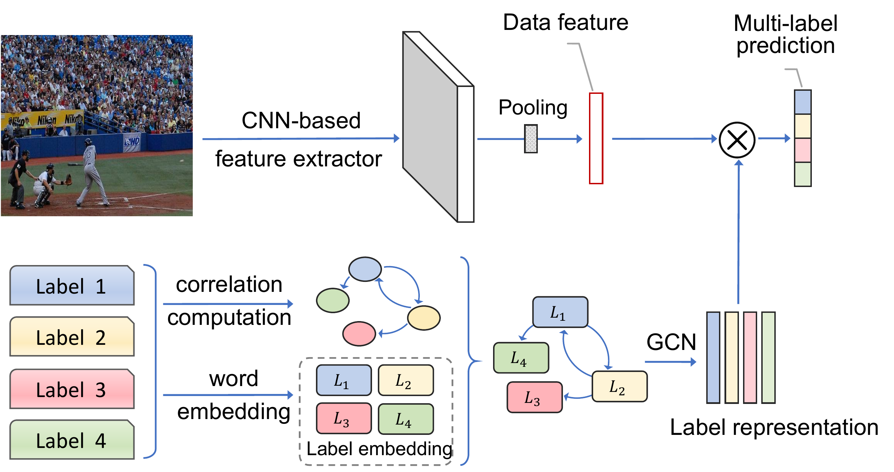
    </td>
  </tr>
  <tr>
    <td style="width:50%">
      <b>Relational Multi-Task Learning: Modeling Relations between Data and Tasks</b> 
      <a href="https://arxiv.org/abs/2303.07666"><i>[Paper]</i></a> 
      <a href = "https://paperswithcode.com/paper/relational-multi-task-learning-modeling-1#code"><i>[Code]</i></a>
       
      <b>Authors:</b> Kaidi Cao, Jiaxuan You, Jure Leskovec  
      <b>Publisher:</b> ParXiv preprint arXiv:2303.07666  
      <b>Year:</b> 2023 
    </td>
    <td style="width:50%">
      
    </td>
  </tr>
</table>
<!-- 
## Architectures

<!-- 
### Encoder-based

### Decoder-based --> -->

<!-- DO NOT DELETE THIS LINE -->
Visitor Count: 
